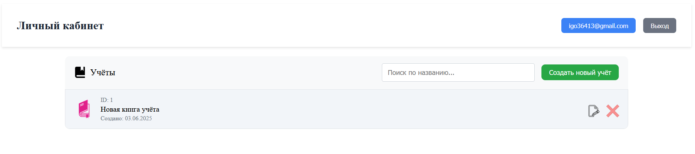
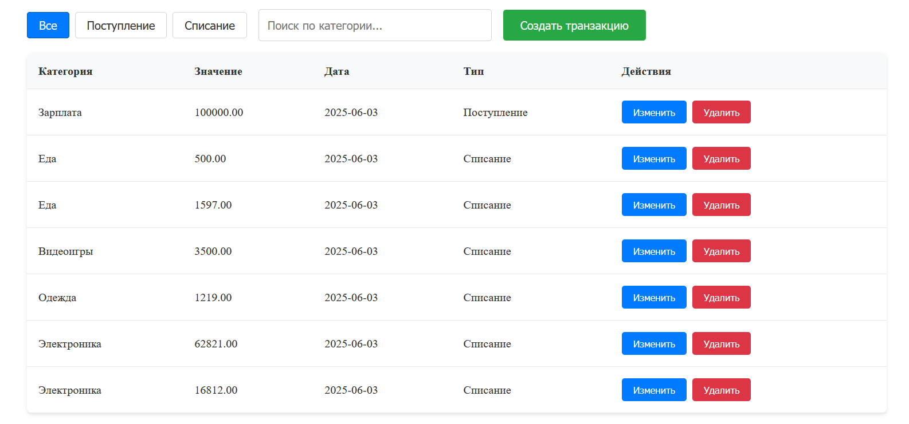

# Паспорт проекта "Trainacc"

## Описание

Сервис предлагает удобный контроль финансов 

#### Технические детали:
Разработка ведется на ASP.NET Core, Entity Framework (Backend).
Frontend ведется на React, для БД используется Postgresql. Дизайн был построен с помощью Figma. Также будет использован Docker, собственно развернут проект будет с его помощью. Мобильное приложение не планируется, только веб.

## Сценарии использования. Логика работы системы.
Вход осуществляется по электронной почте. Впоследствии можно отредактировать профиль.
При первом подключении к системе автоматически создается новая учетная книга.
Есть возможность создать новую книгу учета.

### Добавление вклада 

Пользователь может добавить новый вклад с подробной информацией о нем. 

### Добавление счета

### Добавление кредита

### Создание транзакции 

### Добавление ограничений

### Просмотр отчетов

